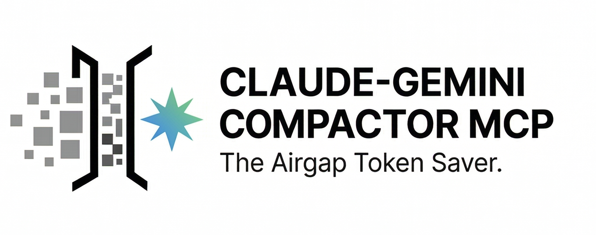

<div align="center">



# Claude-Gemini Compactor MCP


[](https://opensource.org/licenses/MIT)
[](https://nodejs.org/)
[](https://modelcontextprotocol.io/)
[](https://github.com/SuarezPM/claude-gemini-compactor-mcp/releases)
[](CONTRIBUTING.md)

</div>

---

> **A perfect closed circuit. Your Anthropic token quota, untouched.**
> **v4.0: Smart Multi-Provider Router — Gemini · DeepSeek · Groq · OpenRouter · Ollama. Task-type routing. Cost tracking. 7 autonomous tools.**

---

## The Problem with Claude + Large Files

Every time Claude reads a massive file, something dies inside your token budget.

A 10,000-line log. A 500KB API dump. A folder of weekly reports.
Claude loads it all into its context window — and you pay for every single token.
Then it forgets. And loads it again on the next message.

**This is the hidden tax on every developer using Claude Code at scale.**

---

## The Solution: A Context Bypass Bridge

The Compactor is **not** a wrapper. It is not a prompt trick. It is not a workaround.

It is a **context bypass bridge** — a lightweight MCP server written in ~50 lines of Node.js that runs natively and transparently in your OS terminal. It teaches Claude one sacred rule:

> **Never read the file. Pass the path. Let the bridge handle the rest.**

Claude passes an absolute file path as a string. That is all it knows. Our Node.js server intercepts the path, reads the raw bytes from your local disk without ever touching Claude's cognitive memory, tunnels the data directly into the Gemini Flash API, and writes the analyzed result back to disk in Markdown — all in a closed circuit Claude never enters.

**The result: you spend \~500 Claude tokens where you used to spend 80,000.**

---

## How the Circuit Works

<div align="center">

</div>

```
╔══════════════════╗   "here's the path"    ╔════════════════════════╗
║      CLAUDE      ║ ────────────────────►  ║   COMPACTOR SERVER     ║
║                  ║                        ║   (Node.js, ~200 loc)  ║
║  context stays   ║ ◄────────────────────  ║   reads disk locally   ║
║  clean · cheap   ║   distilled answer     ╚════════════════════════╝
║  ~500 tokens ✓   ║   (~500 tokens)
╚══════════════════╝                                       │ raw bytes
                                                           │ (no Claude tokens burned)
                                                           ▼
                                             ╔═══════════════════════════╗
                                             ║  SMART ROUTER  (v4)       ║
                                             ║  task_type routing        ║
                                             ║  ingest  → Gemini first   ║
                                             ║  fast    → Groq first     ║
                                             ║  cheap   → DeepSeek first ║
                                             ║  local   → Ollama first   ║
                                             ║  auto-fallback on quota   ║
                                             ╚═══════════════════════════╝
                                                         │
                                                         │ analyzed result
                                                         ▼
                                             ╔═══════════════════════╗
                                             ║    LOCAL DISK         ║
                                             ║    output.md          ║
                                             ╚═══════════════════════╝
```

**The 4-step closed circuit:**

1. **Claude passes a path string.** It never sees the file contents. Not one byte.
2. **Node.js reads the disk locally.** Silent. No network. No Claude memory involved.
3. **Smart router picks the best provider** — based on `task_type` (ingest/fast/cheap/local), then auto-falls back on quota. Claude's quota: untouched.
4. **The result lands on disk** (or returns to Claude) as a clean, distilled answer with token counts and cost.

---

## Our Mission

The developer ecosystem is **desperately searching** for efficient ways to delegate tasks across models — to save tokens, reduce costs, and sharpen logical reasoning by keeping each model in its lane.

Claude reasons. The Router ingests, routes, and costs. Each model stays in its lane.

This project is proof that you don't need a complex orchestration framework to do multi-model delegation. You need **a clear AIRGAP protocol and smart task-type routing.**

---

## Table of Contents

- [Prerequisites](#prerequisites)
- [Installation](#installation)
- [Configuration](#configuration)
- [Usage](#usage)
- [Tool Reference](#tool-reference)
- [Model Selection Guide](#model-selection-guide)
- [Security](#security)
- [Token Savings](#token-savings)
- [Troubleshooting](#troubleshooting)
- [Contributing](#contributing)
- [License](#license)

---

## Prerequisites

- **Node.js ≥ 18** — required for native `fetch()` and ESM support
- **npm ≥ 9**
- **At least one cloud AI provider API key** (free tiers are sufficient):
  - **Gemini** (ingest/large-context): [Google AI Studio](https://aistudio.google.com/) — 1M token context
  - **DeepSeek** (cheap/reason): [platform.deepseek.com](https://platform.deepseek.com/) — 64K context, $0.27/M tokens
  - **Groq** (fast/free): [console.groq.com](https://console.groq.com/) — 128K context, ultra-fast
  - **OpenRouter** (fallback/web): [openrouter.ai](https://openrouter.ai/) — 1M context, free tier
  - **Ollama** (local/offline): [ollama.com](https://ollama.com/) — no API key required, always active if installed
- **Claude Code** or any MCP-compatible client

---

## Installation

```bash
git clone https://github.com/SuarezPM/claude-gemini-compactor-mcp.git
cd claude-gemini-compactor-mcp
npm install
cp .env.example .env   # then add your API key(s)
```

---

## Configuration

Register the server in your MCP client. The server **exits immediately with a clear message** if no API keys are configured — no silent failures.

Add at least one key to your `.env`:

```env
GEMINI_API_KEY=your_google_ai_studio_key_here    # ingest / large-context (1M ctx)
DEEPSEEK_API_KEY=your_deepseek_key_here          # cheap / reasoning ($0.27/M)
GROQ_API_KEY=your_groq_key_here                  # fast / free (128K ctx)
OPENROUTER_API_KEY=your_openrouter_key_here      # fallback / web (1M ctx)
# OLLAMA_BASE_URL=http://localhost:11434/v1       # local — no key needed, always active
```

Smart routing fires automatically based on `task_type`. Fallback fires on quota or rate-limit. Only providers with a configured key (or Ollama) are included.

### Claude Code (CLI)

`~/.claude/claude_desktop_config.json`:

```json
{
  "mcpServers": {
    "gemini-compactor": {
      "command": "node",
      "args": ["/absolute/path/to/claude-gemini-compactor-mcp/server.js"]
    }
  }
}
```

### Claude Desktop (App)

| Platform | Config file path |
| --- | --- |
| macOS | `~/Library/Application Support/Claude/claude_desktop_config.json` |
| Windows | `%APPDATA%\Claude\claude_desktop_config.json` |
| Linux | `~/.config/claude/claude_desktop_config.json` |

Restart Claude after saving. All **7 tools** will appear automatically.

> **Note:** `GEMINI_API_KEY` is loaded from `.env` by dotenv at startup. It is already in `.gitignore`. Never commit it.

---

## Usage

### Analyze a massive log without burning Claude tokens

```
Claude, use ask_gemini with instruction "Extract all CRITICAL and ERROR entries,
group by frequency, top 10 only" on input_file "/var/log/syslog"
and save to "docs/errors.md".
```

### Extract structured data from a large file

```
Claude, use ask_gemini with instruction "Extract the 5 most competitive price
patterns with their frequency" on input_file "data/dump.txt"
with output_format "json".
```

### Ingest a URL without Claude seeing the response body

```
Claude, use ask_gemini_url with url "https://api.example.com/data"
and instruction "Extract all product prices as a JSON array" with output_format "json".
```

### Summarize a full week of logs in one call

```
Claude, use ask_gemini_batch with input_files ["logs/mon.log", "logs/tue.log",
"logs/wed.log", "logs/thu.log", "logs/fri.log"] and instruction
"Summarize all ERROR entries by day" and save to "docs/weekly_errors.md".
```

---

## Tool Reference

### `ask_gemini` — Single file or prompt

Auto-triggered for log files >100 lines, bulk data extraction, or any task where Claude would otherwise read large raw content.

| Parameter | Required | Type | Description |
| --- | --- | --- | --- |
| `instruction` | ✅ | string | What the AI should do |
| `input_file` | ❌ | string | File path — Claude never sees the content |
| `output_file` | ❌ | string | Path to save the result to disk |
| `model` | ❌ | enum | `flash-lite` · `flash` · `pro` (default: `flash-lite`) |
| `output_format` | ❌ | enum | `text` · `json` (default: `text`) |
| `task_type` | ❌ | enum | `ingest` · `fast` · `cheap` · `reason` · `local` · `auto` (default: `auto`) |

### `ask_gemini_url` — URL ingestion

Fetches a URL locally via Node.js. Claude never sees the raw HTML or response body.

| Parameter | Required | Type | Description |
| --- | --- | --- | --- |
| `url` | ✅ | string | URL to fetch and process |
| `instruction` | ✅ | string | What the AI should do with the content |
| `output_file` | ❌ | string | Path to save the result |
| `model` | ❌ | enum | Default: `flash-lite` |
| `output_format` | ❌ | enum | Default: `text` |

### `ask_gemini_batch` — Parallel multi-file ingestion

Reads all files simultaneously via `Promise.all()` and sends them in a single call.

| Parameter | Required | Type | Description |
| --- | --- | --- | --- |
| `instruction` | ✅ | string | What the AI should do with all files |
| `input_files` | ✅ | string[] | Array of file paths |
| `output_file` | ❌ | string | Path to save the combined result |
| `model` | ❌ | enum | Default: `flash-lite` |
| `output_format` | ❌ | enum | Default: `text` |
| `task_type` | ❌ | enum | Default: `auto` |

### `ask_gemini_diff` — Diff / patch analysis

Auto-triggered when working with `.diff` or `.patch` files >100 lines, or when asked to review a git diff.

| Parameter | Required | Type | Description |
| --- | --- | --- | --- |
| `diff_file` | ✅ | string | Path to `.diff` or `.patch` file |
| `instruction` | ✅ | string | Analysis goal (e.g., "find breaking changes") |
| `output_file` | ❌ | string | Path to save the analysis |
| `model` | ❌ | enum | Default: `flash-lite` |
| `output_format` | ❌ | enum | Default: `text` |

### `ask_gemini_schema` — Schema / data model analysis

Auto-triggered on `.prisma`, `.sql`, `.graphql`, or OpenAPI/Swagger files.

| Parameter | Required | Type | Description |
| --- | --- | --- | --- |
| `schema_file` | ✅ | string | Path to schema file |
| `instruction` | ✅ | string | Analysis goal (e.g., "find N+1 risks") |
| `output_file` | ❌ | string | Path to save the analysis |
| `model` | ❌ | enum | Default: `flash-lite` |
| `output_format` | ❌ | enum | Default: `text` |

### `ask_gemini_compact` — Context compaction

Auto-triggered on `/compact` requests or when a file exceeds 50KB. Summarizes content to reduce context load.

| Parameter | Required | Type | Description |
| --- | --- | --- | --- |
| `input_file` | ✅ | string | File to compact |
| `instruction` | ❌ | string | Focus for the summary (default: concise summary) |
| `output_file` | ❌ | string | Path to save the compacted result |
| `model` | ❌ | enum | Default: `flash-lite` |

### `ask_ollama` — Local / offline inference

Auto-triggered for offline, private, or local-only requests. Requires Ollama running at `OLLAMA_BASE_URL` (default: `http://localhost:11434/v1`).

| Parameter | Required | Type | Description |
| --- | --- | --- | --- |
| `instruction` | ✅ | string | What the local model should do |
| `input_file` | ❌ | string | File path to process locally |
| `output_file` | ❌ | string | Path to save the result |
| `model` | ❌ | enum | Default: `flash-lite` (maps to `llama3.2`) |
| `output_format` | ❌ | enum | Default: `text` |

---

## Model Selection Guide

| Key | Best for | Speed | Cost |
| --- | --- | --- | --- |
| `flash-lite` | Bulk log parsing, large data extraction, high-volume batch jobs | ⚡⚡⚡ | Free tier |
| `flash` | Structured extraction, code analysis, multi-file summarization | ⚡⚡ | Low |
| `pro` | Complex reasoning, nuanced analysis, long-form reports | ⚡ | Standard |

**Default is \****`flash-lite`** — handles 95% of use cases on free tier.

Each key maps to the best available model per provider:

| Key | Gemini | DeepSeek | Groq | OpenRouter | Ollama |
| --- | --- | --- | --- | --- | --- |
| `flash-lite` | `gemini-2.0-flash-lite` | `deepseek-chat` | `llama-3.3-70b-versatile` | `gemini-2.0-flash-exp:free` | `llama3.2` |
| `flash` | `gemini-2.0-flash` | `deepseek-chat` | `llama-3.3-70b-versatile` | `gemini-2.0-flash-exp:free` | `llama3.3` |
| `pro` | `gemini-1.5-pro` | `deepseek-reasoner` | `llama-3.3-70b-versatile` | `llama-4-maverick:free` | `llama3.3` |

---

## Security

The server enforces four hard guarantees on every operation:

**1. Path traversal protection** — `path.relative()` validation blocks `../../etc/passwd`-style attacks before any disk read occurs. The naive `startsWith(cwd)` check it replaced was bypassable.

**2. 50MB file size cap** — files exceeding 50MB are rejected before being read into memory, preventing OOM crashes on unexpectedly large inputs.

**3. SSRF guard** — `ask_gemini_url` blocks `file://`, private IPs (10.x, 172.16–31.x, 192.168.x), localhost, and `.local`/`.internal` hostnames.

**4. Fail-fast provider validation** — the server exits at startup with `[FATAL] No API keys configured` if no keys are present. No silent runtime failures mid-task.

---

## Token Savings

| Scenario | Without Compactor | With Compactor | Savings |
| --- | --- | --- | --- |
| 10K-line log analysis | ~80,000 Claude tokens | ~500 Claude tokens | **99.4%** |
| 500KB data dump | Context overflow | ~800 Claude tokens | ∞ |
| 5-file batch audit | 5× full file reads | ~1,200 Claude tokens | **\~98%** |
| URL ingestion (50KB page) | ~40,000 Claude tokens | ~600 Claude tokens | **98.5%** |

*Claude token estimates at \~4 chars/token. Gemini usage billed separately to your Google AI account.*

---

## Troubleshooting

**`[FATAL] No API keys configured`**
→ Run `cp .env.example .env` and add at least one cloud key: `GEMINI_API_KEY`, `DEEPSEEK_API_KEY`, `GROQ_API_KEY`, or `OPENROUTER_API_KEY`. Ollama alone is not sufficient.

**`[WARN] Provider 'gemini' quota/rate-limit hit. Trying next provider...`**
→ Expected behavior. Smart routing is working. Add `DEEPSEEK_API_KEY`, `GROQ_API_KEY`, or `OPENROUTER_API_KEY` for more fallback options.

**`[WARN] Provider 'ollama' failed. Trying next provider...`**
→ Ollama is not running or not reachable at `OLLAMA_BASE_URL`. Start Ollama with `ollama serve` or set `OLLAMA_BASE_URL` correctly.

**`Access denied: '../../etc/passwd' is outside the working directory`**
→ Use paths relative to your project root. The path guard is working correctly.

**`File too large: 62.3MB exceeds 50MB limit`**
→ Pre-filter or split the file before passing it to the tool.

**Tool does not appear in Claude after config change**
→ Restart Claude completely. MCP servers are loaded at startup, not hot-reloaded.

**`HTTP 403 fetching: https://...`**** on ask\_gemini\_url**
→ The target server is blocking automated requests. Check if authentication is required.

---

## Contributing

1. Fork the repository
2. Create a feature branch: `git checkout -b feat/your-feature`
3. Commit following [Conventional Commits](https://www.conventionalcommits.org/)
4. Open a Pull Request against `master`

New tools should follow the `ask_gemini_*` naming pattern and use the shared `callWithFallback()` and `writeOutput()` helpers. Keep `server.js` focused on the AIRGAP Protocol — no bloat.

---

## License

MIT © 2025–2026 Pablo ([SuarezPM](https://github.com/SuarezPM))
